# Zakaria EL HANID
# Phone: 06 00 61 79 08
# Email: zakaria.elhanid@gmail.com 

# Introduction 
The main goal of this project is to build an API that allows you to manage a collection of books and their authors.

# Getting Started
To use this project, just clone it in your workspace.
You should have JDK 17, ZooKeeper and Kafka servers started in your machine.

# Build and Test
To build the project in order to run on your local machine.

When starting the BookApplication, an in-memory database server H2 will start on localhost:8080/h2
A 'books' database with two tables (book and author) will be created, and these two tables will be automatically populated each time the application starts.

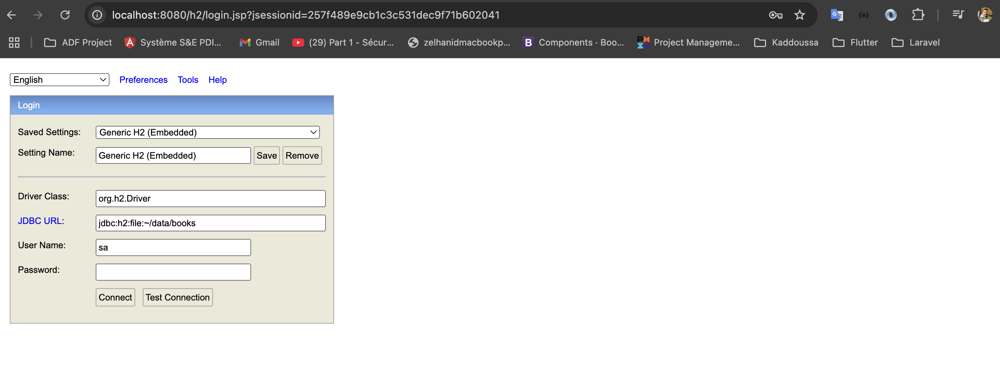

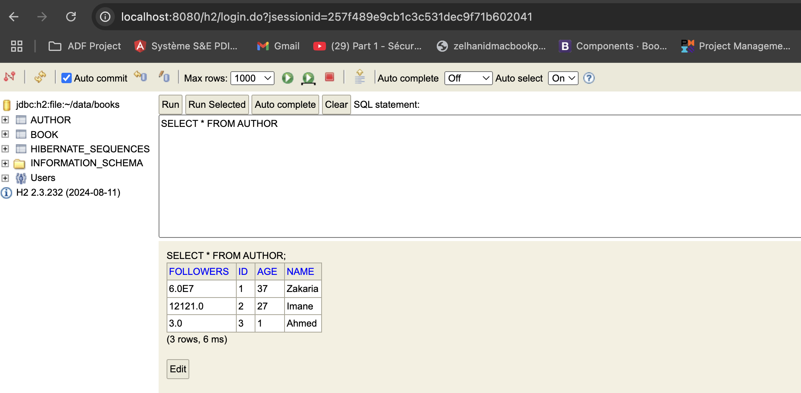

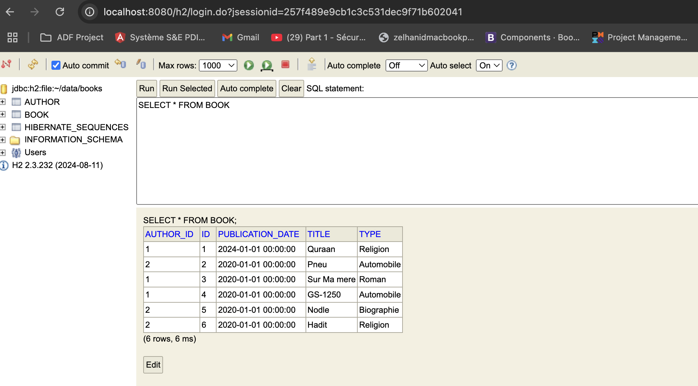

Once checking that tables are well created and injected, you can test all developed endpoints : 
All developed endpoints are described on Swagger :

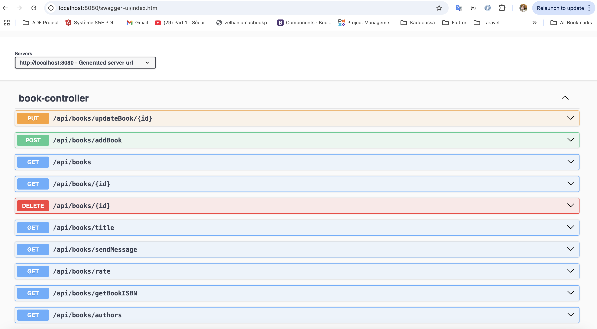

@GetMapping("/api/books"):

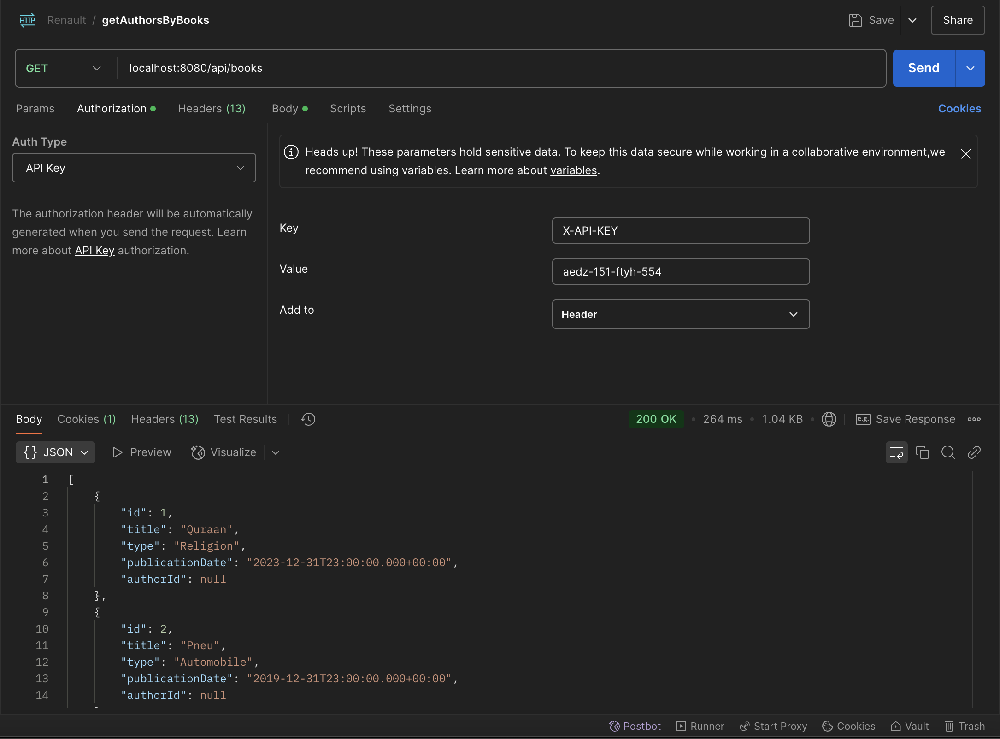

@GetMapping("/{id}"):

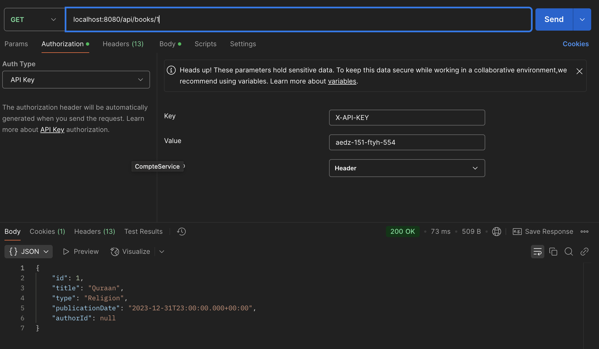

@GetMapping("/title"):

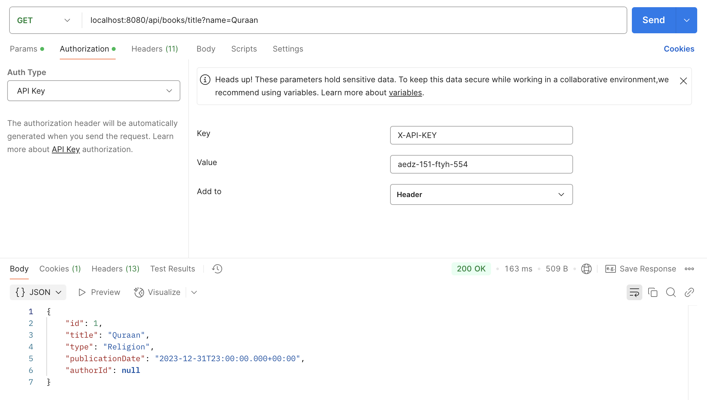

@PostMapping("/addBook"):

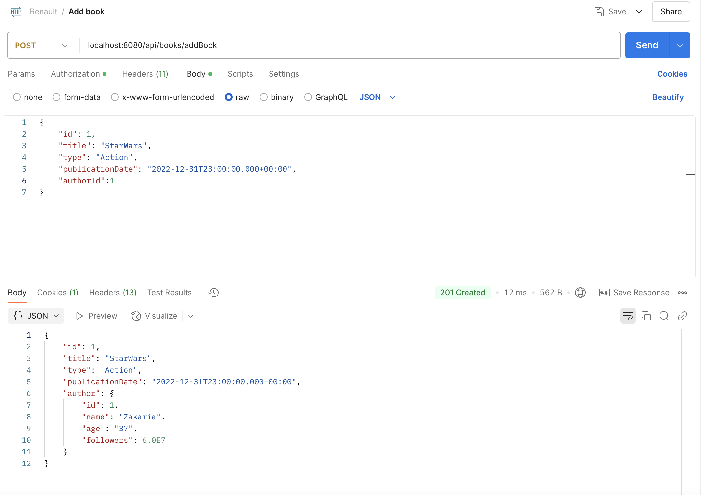

@PutMapping("/updateBook/{id}"):

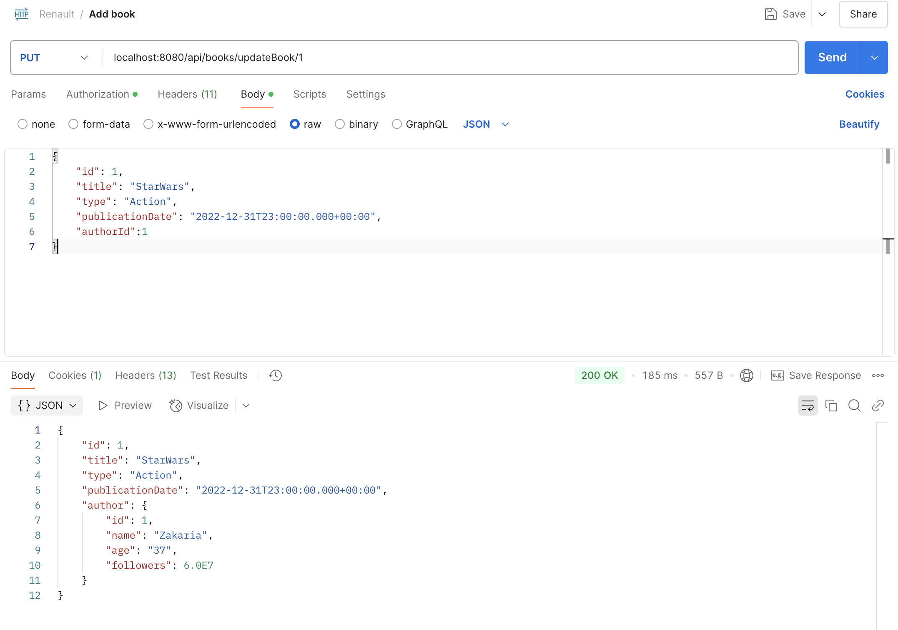

@GetMapping("/authors"):

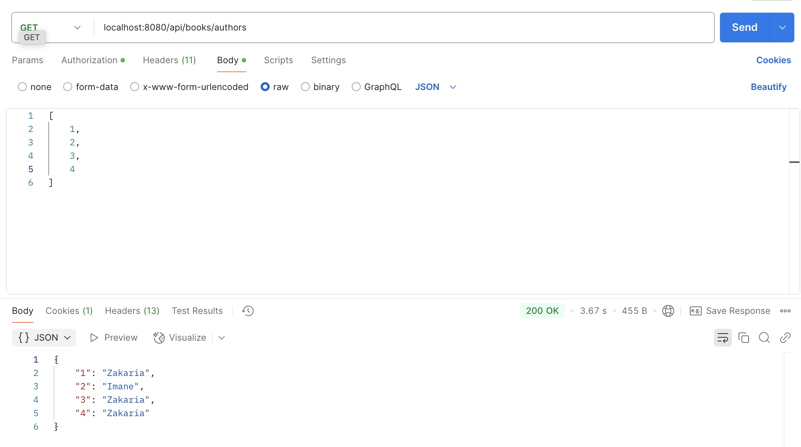

@GetMapping("/getBookISBN"):

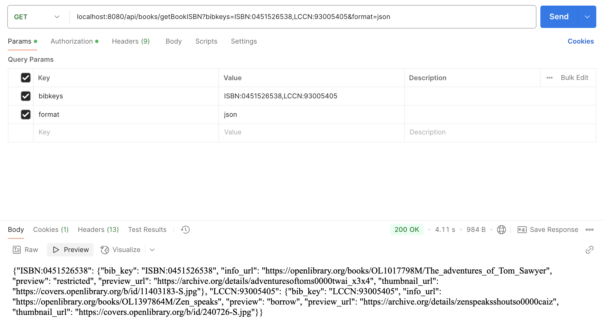

@GetMapping("/rate"):

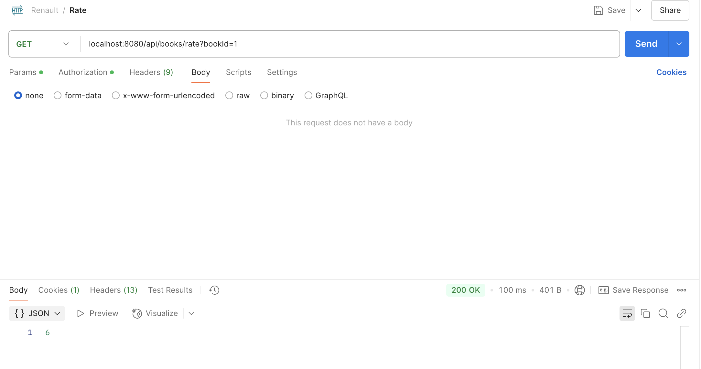

@GetMapping("/sendMessage"):

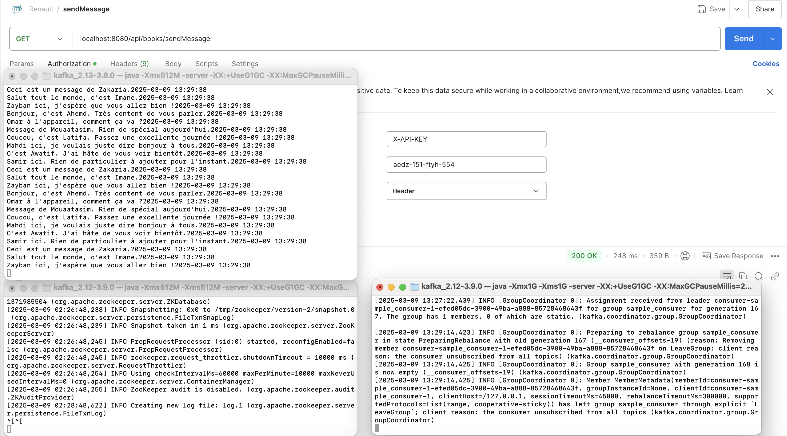

